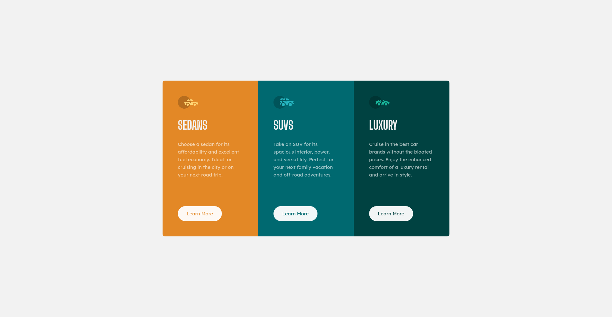

# Frontend Mentor - 3 Column Preview Card solution

This is a solution to the 3 Column Preview Card challenge on [Frontend Mentor](https://www.frontendmentor.io/).

## Table of contents

- [Overview](#overview)
	- [Screenshot](#screenshot)
	- [Links](#links)
- [My process](#my-process)
	- [Built with](#built-with)
	- [What I learned](#what-i-learned)
	- [Useful resources](#useful-resources)
- [Author](#author)

## Overview

### Screenshot



### Links

- Solution URL: [GitHub - OignonFugace/FEM__3-column-preview-card-component](https://github.com/OignonFugace/FEM__3-column-preview-card-component)
- Live Site URL: [Frontend Mentor | 3-column preview card component](https://oignonfugace.github.io/FEM__3-column-preview-card-component/)

## My process

### Built with
- HTML Markup
- CSS
- CSS Flex Box

### What I learned
Newbie stuff as I am entering the front-end development world: I learned HTML and CSS (fundamental text and font styling, fundamental layout, the cascade, specificity, etc)
More specifically, from this challenge and a bunch of other newbie challenges, I learned about :
- CSS Media Queries
- Advanced CSS Selectors
- Classes naming principles/conventions
- CSS Flexbox and Grid
- Adding custom fonts using `@font-face` rules, instead of importing them from Google Fonts services for better performance.
- CSS custom properties
- The `mix-blend-mode` CSS property that I am using for this project to avoid repeating code (see below : ) 

```css
/* This : */

.card-item__btn {
	color: black;
	mix-blend-mode: screen;
}

.card-item__btn:hover {
	color: var(--very-ligh-gray-color);
}

/* Instead of this : */

.card-item:nth-child(1) .btn {
	color: var(--primary-bright-orange);
}

.card-item:nth-child(2) .btn {
	color: var(--primary-dark-cyan);
}

.card-item:nth-child(3) .btn {
	color: var(--primary-very-dark-cyan);
}


.card-item:nth-child(n) .btn:hover {
	color: var(--very-ligh-gray-color);
}
```


### Questions to community
- About my use of `mix-blend-mode` :
	- The use of `mix-blend-mode` here is some sort of a hack because it does not render the button background as expected : `--very-ligh-gray-color` (initial button `background-color`) is not exactly `white` hence the `sreen` value for `mix-blend-mode` blend it with the background color of the parent that is orange or blue, resulting in a slightly colored button background color. Of course in this case this not visible, but say we change the button background color to some other shade of gray, it could became problematic. 
	- So **first question** : is there a way to overcome this using `mix-blend-mode` ? It would be great to be able to nest a paragraph inside the button (`<a href="#" class="btn hello card-item__btn"><p>Learn More</p></a>`) and apply `mix-blend-mode` on that paragraph, but blending with second parent in the hierarchy.
	- **Second question** : any other way to match the `color` of the button with the `background-color` of the parent automatically, without having to hard-code the color for each button ? 
		- (I am thinking of using scss or sass, but not willing to dive in those at this stage.)

- Every other feedback are much appreciated ! Especially about my use of HTML semantic elements. Should I use `header`, `section`, ..., what are best practices to divide such card-items into semantic parts ? What about the `h1`, are `h2` better in this case ?


### Useful resources
Text styling and fonts :
- [Fundamental text and font styling - Learn web development | MDN](https://developer.mozilla.org/en-US/docs/Learn/CSS/Styling_text/Fundamentals)
- [Why You Should STOP Using Google Fonts (And How to Self-Host Your Own Web Fonts) - YouTube](https://www.youtube.com/watch?v=363s_ziVwTg)
	- [google webfonts helper](https://google-webfonts-helper.herokuapp.com/fonts)

CSS selectors
- [Guide to Advanced CSS Selectors - Part One | Modern CSS Solutions](https://moderncss.dev/guide-to-advanced-css-selectors-part-one/)

Classes naming conventions
- [Bref, voici comment écrire du CSS maintenable et évolutif. Comment nommer ses class CSS. | by @maisonfutari | Medium](https://medium.com/@arieldi/bref-voici-comment-%C3%A9crire-du-css-maintenable-et-%C3%A9volutif-comment-nommer-ses-class-css-cbe4b3437b49)
- [Organisation et convention de nommage CSS - karac blog](https://karac.ch/blog/organisation-et-convention-nommage-css)

Grid and Flexbox
- [A Complete Guide to Grid | CSS-Tricks - CSS-Tricks](https://css-tricks.com/snippets/css/complete-guide-grid/)
- [A Complete Guide to Flexbox | CSS-Tricks - CSS-Tricks](https://css-tricks.com/snippets/css/a-guide-to-flexbox/)

CSS Custom Properties
- [Making CSS more efficient with CSS Variables - YouTube](https://www.youtube.com/watch?v=w-bq8f8hs1I)

`mix-blend-mode` property
- [Les "Blend-mode" en CSS 🎨 - YouTube](https://www.youtube.com/watch?v=3q9KhKfp0pQ)


## Author
- Website - [Oignon Fugace - par Tanguy Freycon](https://oignonfugace.com/)
- Frontend Mentor - [@OignonFugace](https://www.frontendmentor.io/profile/OignonFugace)


